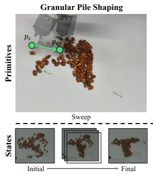
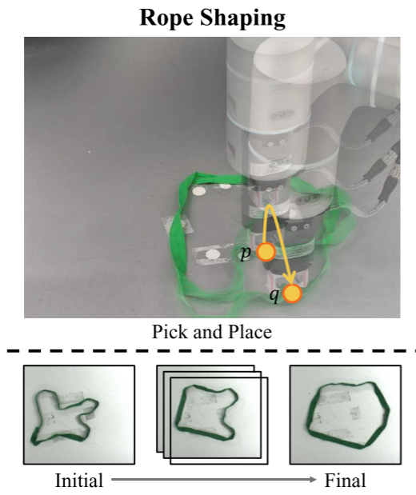
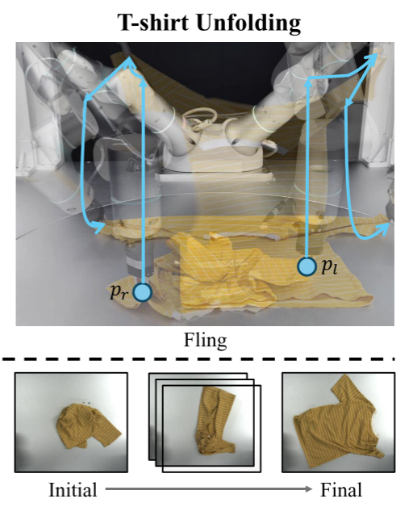
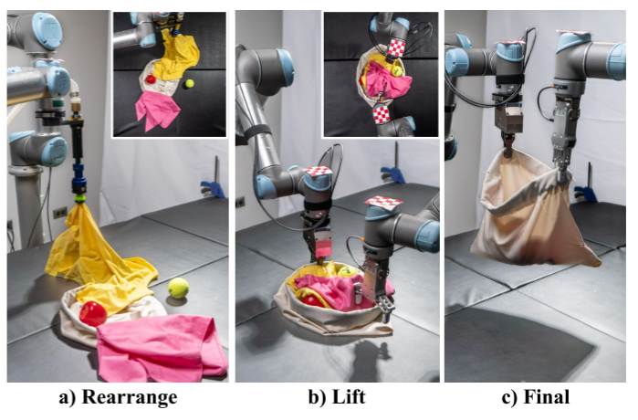
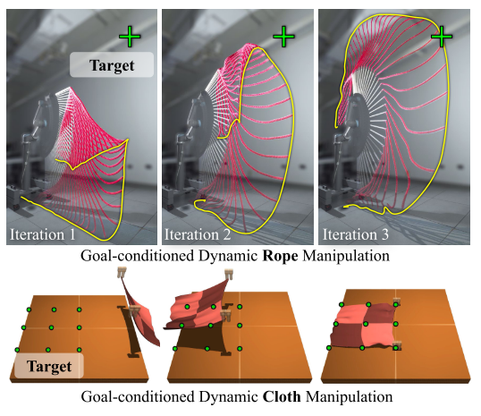

<h1 align="center">柔性物体操作指南 Deformable-Object-Manipulation-Guide</h1>

 

> Deformable-Object-Manipulation 为从事可变形物体 (DOM) 机器人操纵工作的研究人员和从业人员提供的一份指南。
Latest Update: July. 24, 2025

# Contents - 目录
<nav>
  <ul>
    <li><a href="#start">1. Start From Here - 从这里开始</a></li>
    <li><a href="#info">2. Useful Info - 有利于搭建认知的资料</a></li>
    <li><a href="#task">3. Task - 任务</a>
        <ul>
            <li><a href="#algorithm">3.1 1D任务</a></li>
            <li><a href="#algorithm">3.2 2D任务</a></li>
            <li><a href="#algorithm">3.3 3D任务</a></li>
        </ul>        
    </li>
    <li><a href="#algorithm">4. Algorithm - 算法</a>
        <ul>
            <li><a href="#algorithm">4.1 Traditional Method - 传统方法</a>
                <ul>
                    <li><a href="#algorithm">4.1.1 感知</a></li>
                    <li><a href="#algorithm">4.1.2 建模</a></li>
                    <li><a href="#algorithm">4.1.3 规划</a></li>
                    <li><a href="#algorithm">4.1.4 控制</a></li>
                </ul>
            </li>
            <li><a href="#algorithm">4.2 Learning Based Method - 基于学习方法</a>
                <ul>
                    <li><a href="#algorithm">4.2.1 强化学习</a></li>
                    <li><a href="#algorithm">4.2.2 模仿学习</a></li>                
                </ul>
            </li>
            <li><a href="#algorithm">4.3 End to End Method - 端到端方法</a>
                <ul>
                    <li><a href="#algorithm">4.3.1 隐式端到端</a></li>
                    <li><a href="#algorithm">4.3.2 显式端到端</a></li>
                    <li><a href="#algorithm">4.3.3 分层端到端</a></li>                    
                </ul>
            </li>
            <li><a href="#algorithm">4.4 其他范式</a></li>
        </ul>
    </li>
    <li><a href="#software">5.Software - 软件</a>
        <ul>
            <li><a href="#algorithm">5.1 Simulation - 仿真</a></li>
            <li><a href="#algorithm">5.2 Datasets - 数据集</a></li>
            <li><a href="#algorithm">5.3 Benchmark - 基准</a></li>
        </ul>
    </li>    
    <li><a href="#hardware">6. Hardware - 硬件</a>
        <ul>
            <li><a href="#algorithm">6.1 夹爪</a></li>
            <li><a href="#algorithm">6.2 灵巧手</a></li>                
        </ul>
    </li>
  </ul>
</nav>

<section id="start"></section>

# 1. Start From Here - 从这里开始
> 柔性物体：在外力作用下会发生“显著且可恢复或不可恢复的形变”的物体,其形变自由度远超刚性体，无法用有限个位姿参数描述。 
柔性物体操作：是指机器人利用末端执行器（夹爪、灵巧手或工具）对在外力作用下会发生显著形变的物体进行感知、建模、规划与控制，以实现特定任务目标的全过程。
## How - 如何学习这份指南
希望帮助快速建立领域认知, 所以设计理念是：**简要**介绍目前柔性物体操作的主要技术, 让大家知道不同的技术的设计初衷，能够解决什么问题。
## About us - 关于我们
我们是一个初学者团队，在我们自己的学习过程中，将一些资料、论文、Code整理总结，搭建理论框架的同时, 为后来者提供一些帮助。

<section id="info"></section>

# 2. Useful Info - 有利于搭建认知的资料
* 会议与期刊：Science Robotics, RSS, IROS, ICRA等
* Daily Paper：
    * Hugging Face-Daily Paper：[website](https://huggingface.co/)
    * arXiv-Daily Pape：[website](http://www.arxivdaily.com/)
* Survey：
    * 同济大学（23年12月）：A Survey on Robotic Manipulation of Deformable Objects: Recent Advances, Open Challenges and New Frontiers[J] [paper](https://arxiv.org/abs/2312.10419)
    * 约克大学（22年2月）：Challenges and outlook in robotic manipulation of deformable objects[J] [paper](https://arxiv.org/abs/2105.01767)

<section id="task"></section>

# 3. Task - 任务
| 类别 | 典型任务 | 柔性对象示例 | 技术难点 |
|-------|------|------|------|
| 0D-零碎柔性体	| 塑料颗粒堆形 |              塑料颗粒 |      类似流体的形态难以建模 |
| 1D-线状柔性体	| 打结、解结、布线 |          绳子、线缆 |    高维状态、自交叉、遮挡 |
| 2D-面状柔性体	| 展开、折叠、铺平、遮挡移除 | 布料、衣物 |    形变复杂、抓取点选择、动态遮挡 |
| 3D-体状柔性体	| 抓取、装袋、开启、填充 |     软袋、软组织	|  体积变化、材质差异、形变耦合 |
| 动态柔性操作	| 甩绳击打、空中形变控制 |     弹性杆、柔性板 | 惯性建模、高速视觉、实时控制 |

## 3.1 0D任务

*Figure:  Granular Pole Shaping(image from DeformPAM).*
任务介绍：在这个任务中，机器人需要将一堆杂乱的颗粒状物体（如坚果）扫成字符t的形状。

## 3.2 1D任务

*Figure:  Rope(image from DeformPAM).*
任务介绍：绳索成型，在本任务中，机器人使用拾取-放置原语动作a = (p, q)将随机形状的绳索形成圆形

## 3.3 2D任务

*Figure:  T-shirt Unfolding(image from DeformPAM).*
任务介绍：展开t恤：这项任务的目标是将一件高度皱褶的短袖t恤弄平,或折叠t恤：将一件展平的短袖折叠

## 3.4 3D任务

*Figure:  (image from Bag is all your need).*
任务介绍：装袋任务要求将多个刚性（如苹果）和可变形物体（如t恤）装入可变形袋中。

## 3.4 动态任务

*Figure:  Goal-conditioned Dynamic Rope Manipulation(image from "Iterative Residual Policy for Goal-Conditioned Dynamic Manipulation of Deformable Objects").*
任务介绍：上图：绳子操作任务。 目标配置由目标尖端位置（绿色叉）定义。下图：布料操作任务。 目标配置由目标关键点位置（绿点）定义。

<section id="algorithm"></section>

# 4. Algorithm - 算法

## 4.1 Traditional Method - 传统方法
### 操作 Pipeline

| 阶段 | 输入 / 功能 | 关键技术 |
|------|-------------|----------|
| **感知** | 视觉输入（RGBD / 点云） 触觉输入（力 / 滑移） | • 分割、检测、跟踪 • 状态估计（关键点、形变） |
| **建模** | 感知结果 | • 解析建模（FEM / PBD） • 数据驱动（GNN / Jacobian） |
| **操作** | 环境/物体模型 | • 规划（动作 / 状态空间） • 控制（视觉 / 力控） |
| **执行** | 动作指令 | • 夹子 / 灵巧手 / 工具 |

### 4.1.1 感知
**基于视觉：**
    一个完整的基于视觉的DO状态估计管道包括三个步骤：**分割、检测和跟踪**。 
    **分割：**
    将DO从图像的背景中分离出来 
    **检测：**
    是指从单个图像中估计DO状态的过程 
    **跟踪：**
    是跨多个帧跟踪DO的状态。 

**基于触觉：**
    触觉是一种主要获取摩擦、纹理等局部特征的感觉模态。 
    视触觉传感器：GelSight

### 4.1.2 建模
将Modeling工作理解为对柔性物体的建模，**建模的核心是回答：“如果我这样动，柔性物体会变成什么样？”** 
模型输入：柔性物体的**当前状态**和**执行的动作** 
模型输出：柔性物体被**执行动作后的状态** 

| 类别 | 方法 |	优点 |	缺点 |
|----- |-----|------|------|
| 分析建模（Analytical） |	Mass-Spring-Damper（MSD）、Position-Based Dynamics（PBD）、Finite Element Method（FEM） |	物理可解释、可微分、适合仿真	参数| 难调、不适合大变形、计算量大|
| 数据驱动建模（Data-driven） |	Jacobian矩阵、图神经网络（GNN）、Transformer |	可学习复杂形变、无需物理参数 |	需要大量数据、可解释性差、sim-to-real gap |

#### **全局非线性建模（GNN-based）**

- **思想**：用图神经网络把整个物体建模为一个“粒子图”。
- **结构**：
    - 节点：物体上的点
    - 边：点之间的连接（弹簧、距离约束等）
    - 消息传递：每个点根据邻居的状态更新自己
- **代表模型**：
    - Interaction Network（IN）
    - DPI-Net（Deep Particle Interaction Network）
    - BiIN-LSTM（双向LSTM传播）
- **优点**：可建模复杂形变，适合多种物体
- **缺点**：需要大量训练数据，训练慢

### 4.1.3 规划
**Planning = 给定“现在是什么样”和“我想让它变成什么样”，算出“我该怎么一步步动”。** 
**模型输入：** 
| 名称 | 含义 |	示例 |
|-----|----|-----|
| 当前状态 $x_0$ |	柔性物体的初始配置 |	一根绳子的500个粒子3D坐标 |
| 目标状态 $x_g$ |	期望的最终配置 |	绳子被打成一个“8”字形 |
| 约束条件 |	环境、机器人、物理限制 |	不能与桌面碰撞，夹爪只能移动10cm/s |
| 可选：模型 |	柔性物体的动力学模型（可选 |）	GNN预测器、FEM仿真器 |

**模型输出：** 
| 名称 |	含义 |	示例 |
|-----|----|-----|
| 动作序列 $u_{0:T-1}$ |	机器人在每个时间步的控制命令 |	夹爪在t=0,1,2…T-1时刻的位置、速度或力 |
| 状态轨迹 $x_{0:T}$（可选） |	预测的柔性物体状态演化 |	绳子从直线逐渐变成“8”字的中间形态 |

**举例：用绳子打结** 
| 输入 |	输出 |
|------|--------|
| 当前状态：绳子平放在桌面上 |	动作序列：- 夹爪抓取A点 → 移动到B点 → 绕一圈 → 拉紧 |
| 目标状态：绳子打成一个结 |	状态轨迹：每0.1秒绳子的形状预测 |
| 约束：不能拉断绳子 |	 /|

**方法：** 
**“Shooting in the action space”**是**在动作空间里试动作**
**“Searching state trajectories”**是**在状态空间里找路径**
**举例：用绳子打结** 
| 任务 |	Shooting in action space |	Searching state trajectories |
|-----|------------------------|-------------------------------------|
| 用绳子打结 |	直接优化夹爪的每一步移动（动作），看绳子最终是否打成结 |	先规划绳子应经过的中间形状（状态路径），再反推每一步夹爪该怎么动 |

### 4.1.4 控制
**Control = 根据“当前观测”和“目标状态”，实时输出“下一步动作”来驱动机器人执行。** 

**输入** 
| 名称 |	含义 |	示例 |
|-----|----|-----|
| 当前观测 $y_t$ |	传感器实时获取的柔性物体状态 |	视觉点云、RGB-D图像、触觉力、关节角 |
| 目标状态 $x_g$ |	期望的柔性物体最终形态 |	绳子打成“8”字、布料叠成方块 |
| 可选：当前动作 $u_t$ |	当前或上一时刻的控制命令 |	夹爪当前位置、速度 |

**输出** 
| 名称 |	含义 |	示例 |
|-----|----|-----|
| 控制命令 $u_t$ |	机器人下一步要执行的动作 |	夹爪的6D位姿、速度、力矩 |
| 可选：控制增益 $K$ |	闭环控制器的反馈增益矩阵 |	PID参数、MPC权重 |

| 输入 |	输出 |
|------|--------|
| 当前观测：相机拍摄的布料点云 |	控制命令：夹爪向下移动5cm并夹住左下角 |
| 目标状态：布料被叠成方形 |	闭环调整：根据视觉误差实时调整夹爪轨迹 |

## 4.2 Learning Based Method - 基于学习方法
从系统设计的角度，学习（RL/IL）方法可以被视为对“建模 + 操作”传统流程的替代或封装。但并不是“绕过”建模，而是将建模与操作融合在一个端到端的策略中。

| 场景 | 	推荐方法 |
|------|------------|
| 物体物理特性已知、变形小 | 	建模 + 控制（如FEM+优化） |
| 物体复杂、变形大、交互多样 | 	学习（RL/IL） |
| 数据稀缺、需快速部署 | 	模仿学习（IL） |
| 仿真数据丰富、可训练 | 	强化学习（RL） |
| 需要可解释性 | 	建模+控制 |
| 需要高适应性 | 	学习 |

### 4.2.1 强化学习

#### 4.2.1.1 基础
* 强化学习的数学原理 - 西湖大学赵世钰: [bilibili](https://space.bilibili.com/2044042934/channel/collectiondetail?sid=748665) [GitHub](https://github.com/MathFoundationRL/Book-Mathematical-Foundation-of-Reinforcement-Learning) 
这门课程作为强化学习的入门课程非常合适，可以从数学原理入手了解强化学习。

#### 4.2.1.2 最新工作

### 4.2.2 模仿学习
#### 4.2.2.1 经典工作
- **ACT（Learning Fine-Grained Bimanual Manipulation with Low-Cost Hardware）** ([website](https://tonyzhaozh.github.io/aloha/) [paper](https://arxiv.org/abs/2304.13705) [code](https://github.com/tonyzhaozh/act)), 斯坦福, 2023 RSS，2023.4):  提出ACT（Action Chunking with Transformers）降低累积误差，一次性预测未来 k 步动作块，并以时间集成平滑输出。ACT = Action Chunking + Transformer + CVAE + Temporal Ensemble。

#### 4.2.2.2 最新工作
- **DeformPAM** ([website](https://deform-pam.robotflow.ai/) [paper](https://arxiv.org/abs/2410.11584) [code](https://github.com/xiaoxiaoxh/DeformPAM)), 上交大, 2025 ICRA, 2025.1): 用“少量演示 + 人类偏好 + 扩散原语”解决了长程柔性体操作中的分布漂移与数据饥渴难题，在真实机器人上完成颗粒塑形、绳圈成形和 T 恤展开三项高难度任务。范式：“把长任务拆短 + 用人类偏好给动作打分 + 扩散模型做生成”。（人类偏好引入的有效性有待商榷）

## 4.3 End to End Method - 端到端方法
| 维度 |	显式/隐式 |	分层/非分层 |
|------|-------------|----------|
| 判定标准 |	网络内部是否 显式 划分为感知/规划/控制子模块 |	是否存在 显式高层-低层接口（语言指令/潜向量） |
| 梯度 |	统一（所有子模块一起训练） |	可统一也可不统一（高层可冻结） |
| 示例 |	RT-2（模块可拆+统一梯度）→ 显式E2E |	SayCan（高层LLM+低层Policy，接口清晰）→ 分层E2E |

（注：分层一定是“显式两级接口”，梯度是否统一不是判断标准）
* Survey：
    * 港中文大学（24年5月）：A Survey on Vision-Language-Action Models for Embodied AI [paper](https://arxiv.org/abs/2405.14093)

### 4.3.1 隐式端到端
RT-1、RT-2、Roboflamnigo、OpenVLA、MDT、RDT
### 4.3.2 显式端到端
UniPi、Robodreamer、LAPA、GR系列、GR1
### 4.3.3 分层端到端
LCB、Robodual、Pi0/CogACT
### 4.3.4 其他范式
3DDA、Octo、ATM

### 4.3.5 最新工作
- **GR-3** ([website](https://seed.bytedance.com/zh/public_papers/gr-3-technical-report)[paper](https://arxiv.org/pdf/2507.15493)), 字节跳动, 2025.7.22): 利用Robot Trajectory Data + vision-language data进行训练，再加入VR设备采集的Human Trajectory Data进行微调，指标超过pi0。（主要创新都在训练流程和数据采集）

<section id="software"></section>

# 5. Software - 软件

## 5.1 Simulation - 仿真
| 仿真器 | 对应基准集 |
|-------|------|
| [IsaacGym](https://developer.nvidia.com/isaac-gym) | [legged gym](https://github.com/leggedrobotics/legged_gym) [parkour(包括蒸馏以及真机部署)](https://github.com/ZiwenZhuang/parkour) [extreme-parkour](https://github.com/chengxuxin/extreme-parkour) |
| [IsaacSim](https://developer.nvidia.com/isaac/sim) | [BEHAVIOR-1K(可跨平台)](https://behavior.stanford.edu/behavior-1k)+[omniGibson(工具链)](https://behavior.stanford.edu/omnigibson/) [ARNOLD](https://arnold-benchmark.github.io/)   [GarmentLab](https://garmentlab.github.io/) and [DexGarmentLab](https://wayrise.github.io/DexGarmentLab/) |
| [MuJoCo](https://mujoco.org/) | [robosuite](https://robosuite.ai/docs/overview.html)+[robomimic(工具链)](https://robomimic.github.io/) [LIBERO](https://libero-project.github.io/main.html) [MetaWorld](https://meta-world.github.io/) [Gymnasium-Robotics(Fetch; Shadow Dexterous Hand; Maze; Adroit Hand; Franka Kitchen; MaMuJoCo)](https://robotics.farama.org/) [RoboCasa](https://github.com/robocasa/robocasa?tab=readme-ov-file) [RoboHive](https://github.com/vikashplus/robohive) |

## 5.2 Datasets - 数据集

* **DexGarmentLab**, [website](https://wayrise.github.io/DexGarmentLab/) [dataset](https://huggingface.co/datasets/wayrise/DexGarmentLab/tree/main):  来自ClothesNet的8个类别的2500多件服装的大规模数据集，15个任务场景的高质量3D资产。
* **ClothesNet**, [website](https://sites.google.com/view/clothesnet/) [dataset](https://docs.google.com/forms/d/e/1FAIpQLSdE-cUxWSzvC-D99RqkIHI9yLHjvT_5QygszjfqxnB6vIt8vw/viewform):  由约 4400 个模型组成，涵盖 11 个类别，并标注了衣服特征、边界线和关键点。

## 5.3 Benchmark - 基准

<section id="hardware"></section>

# 6. Hardware - 硬件
## 6.1 夹爪
## 6.2 灵巧手